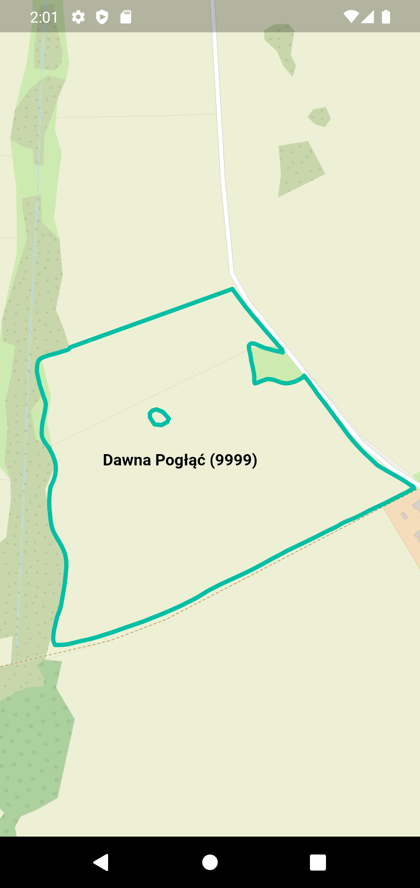

# geometry_on_map_assignment

This project was created as part of a recruitment task. The main task of this application is to display the polygon on the map. The geometry information is stored in WKT format in a json file.

The project used `flutter_riverpod`, `freezed`, `json_serializable`, `geocore` and `flutter_map` packages. In addition, the project was written according to the MVVM pattern.

